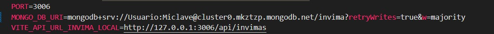

# 💊 App Consulta y Gestión de Medicamentos INVIMA

## 📌 Descripción

Este proyecto surge a partir de una problemática detectada al consultar medicamentos en el sitio oficial del INVIMA (https://www.invima.gov.co/).  
El proceso actual es **lento, manual y propenso a errores**, ya que cada vez que se necesita consultar o actualizar un medicamento en otro sistema, se deben realizar pasos repetitivos y poco eficientes.

Con esta aplicación, se agiliza el proceso de búsqueda y gestión de medicamentos, permitiendo **consultar directamente la API pública del INVIMA** y **guardar los datos en una base de datos MongoDB local**.  
De esta manera, la actualización de información en otros sistemas se vuelve más rápida y confiable...

---

## 🚀 Características

- 🔍 **Búsqueda rápida** de medicamentos por nombre.
- 📊 **Agrupación automática** de resultados por producto.
- 💾 **Guardado en MongoDB** con un solo clic.
- ⚡ **Interfaz moderna** y fácil de usar.
- 🔔 Notificaciones visuales con **SweetAlert2**.
- 🖥 **Modo administrador** para gestionar los medicamentos guardados.

---

## 🛠 Tecnologías utilizadas

- **Frontend:** React.js
- **Estilos:** CSS con estilos en línea optimizados
- **Backend/API:** Node.js + Express
- **Base de datos:** MongoDB
- **Alertas:** SweetAlert2
- **API pública:** Datos abiertos del INVIMA (https://www.datos.gov.co/)

---

## 📂 Flujo de datos

**Explicación del flujo:**

1. El usuario ingresa el nombre del medicamento a buscar.
2. La app consulta directamente la API pública del INVIMA.
3. Se muestran los resultados agrupados por producto.
4. Con un clic en "Guardar en MongoDB", el medicamento se almacena localmente.
5. Desde MongoDB, la información puede integrarse con otros sistemas internos.

---

## 📥 Instalación y uso

### 1️⃣ Clonar el repositorio

```bash
git clone https://github.com/usuario/mi-proyecto-invima.git
cd mi-proyecto-invima


2️⃣ Instalar dependencias del frontend

cd api-invimareact
npm install

3️⃣ Instalar dependencias del backend

cd ../backend
npm install

```

4️⃣ Configurar variables de entorno

## 4️⃣ Configurar variables de entorno

---



---

## .

5️⃣ Ejecutar la aplicación

# En una terminal - backend

cd backend
node index.js

# En otra terminal - frontend

cd api-invimareact
npm run dev

✨ Ejemplo de uso
Buscar un medicamento escribiendo mínimo 3 caracteres.

Visualizar la información agrupada.

Presionar "💾 Guardar en MongoDB" para almacenar localmente.

Consultar y administrar medicamentos desde el módulo de administración.

👨‍💻 Autor

Desarrollado por [Mauricio Barrios]
📧 Contacto: pedidoshmb@gmail.com

```

```
